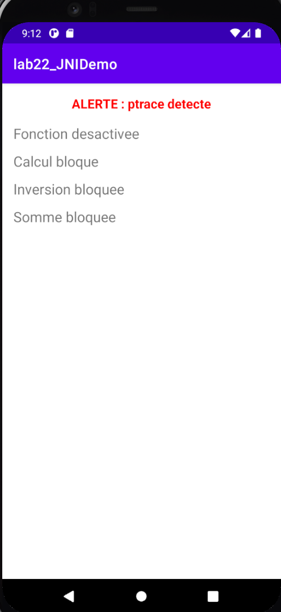
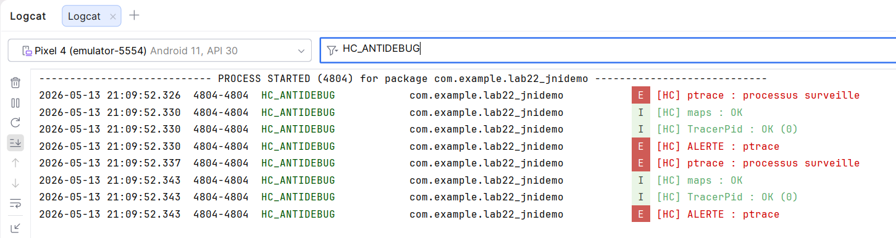

# Lab 23 — JNI Protection : Anti-Debug Natif sur Android

## Présentation

Ce laboratoire étend le Lab 22 (JNIDemo) en ajoutant une couche 
défensive native destinée à repérer des situations anormales 
d'exécution, comme la présence d'un débogueur ou le chargement 
de bibliothèques associées à l'instrumentation dynamique.

---

## Ce qui a été réalisé

### 1. Trois contrôles natifs (amélioration vs version prof)

| Contrôle | Fichier | Description |
|---|---|---|
| `hc_isBeingTraced()` | `/proc/self` | Détection via ptrace |
| `hc_hasSuspiciousLibraries()` | `/proc/self/maps` | Recherche de signatures suspectes |
| `hc_hasTracerPid()` | `/proc/self/status` | Vérification du TracerPid **(ajout HC)** |

### 2. Code d'état détaillé (amélioration vs version prof)

| Code | Signification |
|---|---|
| `0` | Sécurité OK |
| `1` | ptrace détecté |
| `2` | Bibliothèques suspectes |
| `3` | TracerPid détecté |
| `4` | Signaux multiples détectés |

### 3. Classe Java dédiée (amélioration vs version prof)
- `HCSecurityManager` centralise toute la logique de sécurité
- `getSecurityStatus()` retourne un code détaillé
- `getStatusMessage()` retourne un message lisible
- `isSuspicious()` retourne un booléen

### 4. Personnalisation HC
- `LOG_TAG` : `HC_ANTIDEBUG`
- Macros : `HC_LOGI` / `HC_LOGW` / `HC_LOGE`
- Fonctions préfixées : `hc_isBeingTraced`, `hc_hasSuspiciousLibraries`, `hc_hasTracerPid`

---

## Résultats

### Émulateur — Alerte détectée

### Logcat — Logs natifs HC_ANTIDEBUG

---

## Technologies utilisées
- Android Studio
- Java
- C++ / NDK
- CMake
- JNI
- ptrace
- /proc/self/maps
- /proc/self/status
- Logcat
